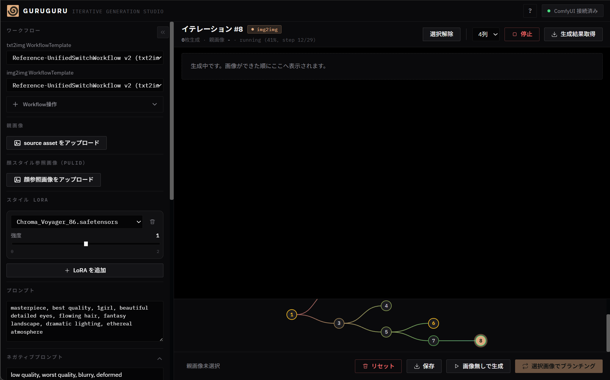

# GURUGURU

ComfyUIで生成した画像を枝分かれさせながら、試行錯誤の履歴を管理するための実験的な画像生成GUIである。

生成結果を親画像にしてimg2imgを繰り返す「イテレーションツリー」を中心に、プロンプトや生成条件の確認、画像へのペイント・マスク・参照画像の添付、Fountain脚本からの漫画制作などをまとめたツールである。

## 経緯

画像生成時のimg2imgイテレーション履歴を管理したい、というアイデアから始めたGUIツール制作。
基本的な画像生成機能が一段落した後、「Fountain脚本から漫画を作成する機能」の開発に着手。本来は脚本からコマ割りなどのネームへ変換する工程にローカルVLMを使用する想定であったが、Codexをオペレーターとすることで一定の形になったため、この趣味プロジェクトの開発に一区切りをつけた。

## イテレーションツリー



画面下部のツリーでは、各生成ラウンドをノード、親画像から派生した生成を枝として表示。ノードを選択することで生成条件や結果を確認でき、任意の画像から新しいブランチを作成可能である。枝の色はデノイズ強度に応じて変化し、元画像からの変化量を追跡しやすい構成。

## 主な機能

- txt2img / img2imgの生成履歴をツリーで管理
- ペイント、inpaintマスク、ポーズControlNet、参照画像の添付
- プロンプト、LoRA、seed、サンプラーなどの生成条件管理
- Fountain脚本の取り込み、コマ割り、吹き出し配置、漫画ページ生成
- PNG、PPTX、OpenRaster（ORA）への書き出し

## 作例

Fountain脚本を取り込み、漫画ページとして一括生成した作例。

- [入力したFountain脚本](Examples/ALICE_REBOOT_E01.fountain)
- [生成した漫画PDF](https://github.com/dwarfsawman/guruguru/releases/download/v0.1.0/ALICE_REBOOT_E01_full_manga.pdf)
- [amazon KDP](https://amzn.asia/d/08fgjX5Z)

PDFは全85ページ。ファイルサイズが大きいため、GitHub Release Assetとして収録。

## 必要なもの

- [Bun](https://bun.sh/) 1.3.14以上
- [Rust](https://www.rust-lang.org/) 1.88以上（`.guruzip`のネイティブ展開処理をビルド）
- 起動済みのComfyUI（既定の接続先は `http://127.0.0.1:8188`）
- 使用するワークフローに応じたComfyUIのモデルとカスタムノード

## 起動方法

```powershell
git clone <このリポジトリのURL>
cd guruguru
bun install
bun run build
bun run start
```

`bun run build`はRustのrelease binaryもビルドして`dist/native/`へ配置する。

起動後のアクセス先は [http://127.0.0.1:5177](http://127.0.0.1:5177)。ComfyUIを別のURLで動かしている場合は、GURUGURUの設定画面でBase URLとWebSocket URLを変更。

開発時に利用できる、ソース変更時の自動ビルド・再起動・ブラウザリロード用コマンド。

```powershell
bun run dev
```

ユーザーデータや生成画像の保存先は、リポジトリ内ではなくOSのユーザーデータディレクトリ（Windowsでは `%LOCALAPPDATA%\GURUGURU`）である。


詳しい開発・運用上の注意は [操作メモ.md](操作メモ.md)、内部設計は [Docs](Docs/README.md) を参照。
